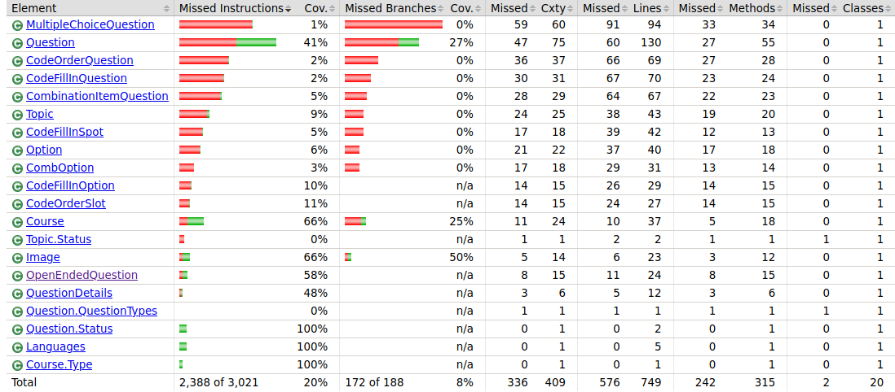
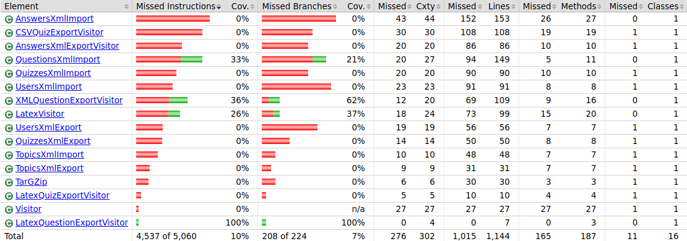
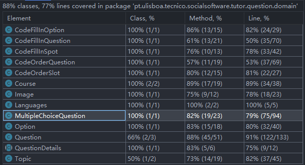
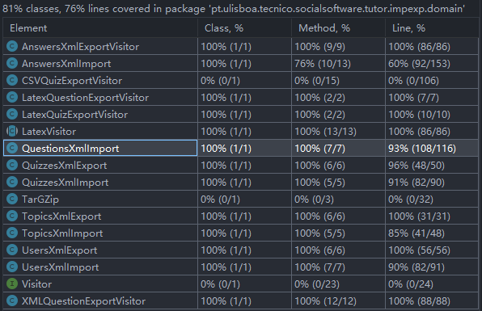
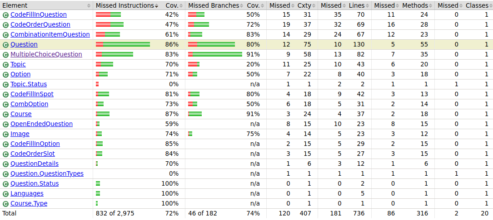
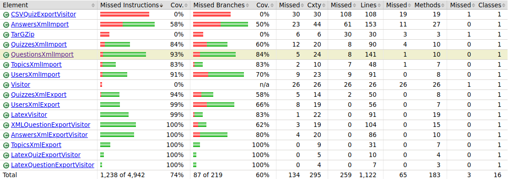

# ES21 P1 submission, Group 09

## Feature PRA

### Subgroup
 - Pedro Marques, 93746, lilpedraotyson
   + Issues assigned: [#6](https://github.com/tecnico-softeng/es21-g09/issues/6), [#20](https://github.com/tecnico-softeng/es21-g09/issues/20), [#22](https://github.com/tecnico-softeng/es21-g09/issues/22), [#34](https://github.com/tecnico-softeng/es21-g09/issues/34), [#35](https://github.com/tecnico-softeng/es21-g09/issues/35), [#36](https://github.com/tecnico-softeng/es21-g09/issues/36)
 - Afonso Bate, 90697, afonsobate
   + Issues assigned: [#6](https://github.com/tecnico-softeng/es21-g09/issues/6), [#20](https://github.com/tecnico-softeng/es21-g09/issues/20), [#22](https://github.com/tecnico-softeng/es21-g09/issues/22), [#34](https://github.com/tecnico-softeng/es21-g09/issues/34), [#35](https://github.com/tecnico-softeng/es21-g09/issues/35), [#36](https://github.com/tecnico-softeng/es21-g09/issues/36)
 
### Pull requests associated with this feature

The list of pull requests associated with this feature is:

 - [PR #021](https://github.com/tecnico-softeng/es21-g09/pull/21)
 - [PR #033](https://github.com/tecnico-softeng/es21-g09/pull/33)
 - [PR #047](https://github.com/tecnico-softeng/es21-g09/pull/47)

### New/Updated domain entities

#### New entities
 - [OpenEndedQuestion](https://github.com/tecnico-softeng/es21-g09/blob/pra/backend/src/main/java/pt/ulisboa/tecnico/socialsoftware/tutor/question/domain/OpenEndedQuestion.java)

#### Entities changed
 - This feature doesnt require changes to any entities. Only requires creation of new entities.
 
### Feature testing

We define one success test, one insuccess test, and tests for invalid input. The direct links to these are:

 - [CreateQuestionTest.groovy](https://github.com/tecnico-softeng/es21-g09/blob/pra/backend/src/test/groovy/pt/ulisboa/tecnico/socialsoftware/tutor/question/service/CreateQuestionTest.groovy)
    + [Success test #1](https://github.com/tecnico-softeng/es21-g09/blob/3d672212e781cc864170bbc1daa4818e4ded0688/backend/src/test/groovy/pt/ulisboa/tecnico/socialsoftware/tutor/question/service/CreateQuestionTest.groovy#L657)
 - [UpdateQuestionTest.groovy](https://github.com/tecnico-softeng/es21-g09/blob/pra/backend/src/test/groovy/pt/ulisboa/tecnico/socialsoftware/tutor/question/service/UpdateQuestionTest.groovy)
    + [Success test #1](https://github.com/tecnico-softeng/es21-g09/blob/3d672212e781cc864170bbc1daa4818e4ded0688/backend/src/test/groovy/pt/ulisboa/tecnico/socialsoftware/tutor/question/service/UpdateQuestionTest.groovy#L408)
 - [RemoveQuestionTest.groovy](https://github.com/tecnico-softeng/es21-g09/blob/pra/backend/src/test/groovy/pt/ulisboa/tecnico/socialsoftware/tutor/question/service/RemoveQuestionTest.groovy)
    + [Success test #1](https://github.com/tecnico-softeng/es21-g09/blob/3d672212e781cc864170bbc1daa4818e4ded0688/backend/src/test/groovy/pt/ulisboa/tecnico/socialsoftware/tutor/question/service/RemoveQuestionTest.groovy#L201)
 - [ImportExportOpenEndedQuestionsTest](https://github.com/tecnico-softeng/es21-g09/blob/pra/backend/src/test/groovy/pt/ulisboa/tecnico/socialsoftware/tutor/impexp/service/ImportExportOpenEndedQuestionsTest.groovy)
    + [XML test](https://github.com/tecnico-softeng/es21-g09/blob/3d672212e781cc864170bbc1daa4818e4ded0688/backend/src/test/groovy/pt/ulisboa/tecnico/socialsoftware/tutor/impexp/service/ImportExportOpenEndedQuestionsTest.groovy#L37)
    + [Latex test](https://github.com/tecnico-softeng/es21-g09/blob/3d672212e781cc864170bbc1daa4818e4ded0688/backend/src/test/groovy/pt/ulisboa/tecnico/socialsoftware/tutor/impexp/service/ImportExportOpenEndedQuestionsTest.groovy#L61)
    

### Test Coverage Screenshot

The screenshot includes the test coverage results associated with the new/changed entities:

---

## Feature PEM

### Subgroup
 - Henrique Lin, 94235, HenriqueLin
   + Issues assigned: [#2](https://github.com/tecnico-softeng/es21-g09/issues/2), [#4](https://github.com/tecnico-softeng/es21-g09/issues/4), [#5](https://github.com/tecnico-softeng/es21-g09/issues/5), [#7](https://github.com/tecnico-softeng/es21-g09/issues/7), [#9](https://github.com/tecnico-softeng/es21-g09/issues/9), [#10](https://github.com/tecnico-softeng/es21-g09/issues/10), [#11](https://github.com/tecnico-softeng/es21-g09/issues/11), [#12](https://github.com/tecnico-softeng/es21-g09/issues/12)
 - Miguel Gonçalves, 94238, Extreme33-ux
   + Issues assigned: [#14](https://github.com/tecnico-softeng/es21-g09/issues/14), [#15](https://github.com/tecnico-softeng/es21-g09/issues/15), [#16](https://github.com/tecnico-softeng/es21-g09/issues/16), [#17](https://github.com/tecnico-softeng/es21-g09/issues/17)
 
### Pull requests associated with this feature

The list of pull requests associated with this feature is:

 - [PR #008](https://github.com/tecnico-softeng/es21-g09/pull/8)
 - [PR #013](https://github.com/tecnico-softeng/es21-g09/pull/13)
 - [PR #018](https://github.com/tecnico-softeng/es21-g09/pull/18)

### New/Updated domain entities

#### New entities
 - This feature require to extende the functionality of existing entities, so there is no new entities.

#### Entities changed
 - [MultipleChoiceQuestion](https://github.com/tecnico-softeng/es21-g09/blob/develop/backend/src/main/java/pt/ulisboa/tecnico/socialsoftware/tutor/question/domain/MultipleChoiceQuestion.java)
   + Added field `ordered` - boolean flag that indicate if the question have order
 - [Option](https://github.com/tecnico-softeng/es21-g09/blob/develop/backend/src/main/java/pt/ulisboa/tecnico/socialsoftware/tutor/question/domain/Option.java)
   + Added field `order` - `null` when there is no order

### Feature testing

We have separated valid tests and invalid tests, also re-organized/update the existing tests. The direct links to these are:

 - [CreateQuestionTest.groovy](https://github.com/tecnico-softeng/es21-g09/blob/develop/backend/src/test/groovy/pt/ulisboa/tecnico/socialsoftware/tutor/question/service/CreateQuestionTest.groovy)
    + [Tests with invalid arguments for `Qustion`](https://github.com/tecnico-softeng/es21-g09/blob/1bc581167ef5241aa0aa8eac58a0116b6a84526e/backend/src/test/groovy/pt/ulisboa/tecnico/socialsoftware/tutor/question/service/CreateQuestionTest.groovy#L22)
    + [Success test #1](https://github.com/tecnico-softeng/es21-g09/blob/1bc581167ef5241aa0aa8eac58a0116b6a84526e/backend/src/test/groovy/pt/ulisboa/tecnico/socialsoftware/tutor/question/service/CreateQuestionTest.groovy#L61)
    + [Success tests #2](https://github.com/tecnico-softeng/es21-g09/blob/1bc581167ef5241aa0aa8eac58a0116b6a84526e/backend/src/test/groovy/pt/ulisboa/tecnico/socialsoftware/tutor/question/service/CreateQuestionTest.groovy#L98)
    + [Tests with invalid arguments for `MultipleChoiceQustion`](https://github.com/tecnico-softeng/es21-g09/blob/1bc581167ef5241aa0aa8eac58a0116b6a84526e/backend/src/test/groovy/pt/ulisboa/tecnico/socialsoftware/tutor/question/service/CreateQuestionTest.groovy#L172)
 - [ImportExportMultipleChoiceQuestionsTest](https://github.com/tecnico-softeng/es21-g09/blob/develop/backend/src/test/groovy/pt/ulisboa/tecnico/socialsoftware/tutor/impexp/service/ImportExportMultipleChoiceQuestionsTest.groovy)
    + [XML test](https://github.com/tecnico-softeng/es21-g09/blob/1bc581167ef5241aa0aa8eac58a0116b6a84526e/backend/src/test/groovy/pt/ulisboa/tecnico/socialsoftware/tutor/impexp/service/ImportExportMultipleChoiceQuestionsTest.groovy#L55)
    + [Latex test](https://github.com/tecnico-softeng/es21-g09/blob/1bc581167ef5241aa0aa8eac58a0116b6a84526e/backend/src/test/groovy/pt/ulisboa/tecnico/socialsoftware/tutor/impexp/service/ImportExportMultipleChoiceQuestionsTest.groovy#L91)

### Test Coverage Screenshot

The screenshot includes the test coverage results associated with the new/changed entities:

---

## Feature PCI

### Subgroup
 - Nome, ist93697, gllam
   + Issues assigned: [#3](https://github.com/tecnico-softeng/es21-g09/issues/3),[#42](https://github.com/tecnico-softeng/es21-g09/issues/42) , [#28](https://github.com/tecnico-softeng/es21-g09/issues/28), [#29](https://github.com/tecnico-softeng/es21-g09/issues/29)
 - Nome, ist93725, JGSalgueiro
   + Issues assigned: [#3](https://github.com/tecnico-softeng/es21-g09/issues/3),[#42](https://github.com/tecnico-softeng/es21-g09/issues/42) ,[#28](https://github.com/tecnico-softeng/es21-g09/issues/28), [#29](https://github.com/tecnico-softeng/es21-g09/issues/29)

### Pull requests associated with this feature

The list of pull requests associated with this feature is:

 - [PR #030](https://github.com/tecnico-softeng/es21-g09/pull/30)
 - [PR #037](https://github.com/tecnico-softeng/es21-g09/pull/37)
 - [PR #043](https://github.com/tecnico-softeng/es21-g09/pull/43)

### New/Updated domain entities

#### New entities
 - [Question](https://github.com/tecnico-softeng/es21-g09/blob/develop/backend/src/main/java/pt/ulisboa/tecnico/socialsoftware/tutor/question/domain/Question.java)
   + Added field `QuestionTypes`
 
### Feature testing
The direct links to the tests executed are:

 - [CreateQuestionTest.groovy](https://github.com/tecnico-softeng/es21-g09/blob/develop/backend/src/test/groovy/pt/ulisboa/tecnico/socialsoftware/tutor/question/service/CreateQuestionTest.groovy)

    + [Success test #1](https://github.com/tecnico-softeng/es21-g09/blob/1bc581167ef5241aa0aa8eac58a0116b6a84526e/backend/src/test/groovy/pt/ulisboa/tecnico/socialsoftware/tutor/question/service/CreateQuestionTest.groovy#L220)
    + [Success tests #2](https://github.com/tecnico-softeng/es21-g09/blob/1bc581167ef5241aa0aa8eac58a0116b6a84526e/backend/src/test/groovy/pt/ulisboa/tecnico/socialsoftware/tutor/question/service/CreateQuestionTest.groovy#L247)
    + [Success tests #3](https://github.com/tecnico-softeng/es21-g09/blob/1bc581167ef5241aa0aa8eac58a0116b6a84526e/backend/src/test/groovy/pt/ulisboa/tecnico/socialsoftware/tutor/question/service/CreateQuestionTest.groovy#L307)

 - [UpdateQuestionTest.groovy](https://github.com/tecnico-softeng/es21-g09/blob/pra/backend/src/test/groovy/pt/ulisboa/tecnico/socialsoftware/tutor/question/service/UpdateQuestionTest.groovy)
    + [Success test #1](https://github.com/tecnico-softeng/es21-g09/blob/3d672212e781cc864170bbc1daa4818e4ded0688/backend/src/test/groovy/pt/ulisboa/tecnico/socialsoftware/tutor/question/service/UpdateQuestionTest.groovy#L81)
    + [Success test #2](https://github.com/tecnico-softeng/es21-g09/blob/3d672212e781cc864170bbc1daa4818e4ded0688/backend/src/test/groovy/pt/ulisboa/tecnico/socialsoftware/tutor/question/service/UpdateQuestionTest.groovy#L117)
    
 - [RemoveQuestionTest.groovy](https://github.com/tecnico-softeng/es21-g09/blob/pra/backend/src/test/groovy/pt/ulisboa/tecnico/socialsoftware/tutor/question/service/RemoveQuestionTest.groovy)
    + [Success test #1](https://github.com/tecnico-softeng/es21-g09/blob/3d672212e781cc864170bbc1daa4818e4ded0688/backend/src/test/groovy/pt/ulisboa/tecnico/socialsoftware/tutor/question/service/RemoveQuestionTest.groovy#L102)
    + [Success test #2](https://github.com/tecnico-softeng/es21-g09/blob/3d672212e781cc864170bbc1daa4818e4ded0688/backend/src/test/groovy/pt/ulisboa/tecnico/socialsoftware/tutor/question/service/RemoveQuestionTest.groovy#L122)

 - [ImportExportMultipleChoiceQuestionsTest](https://github.com/tecnico-softeng/es21-g09/blob/develop/backend/src/test/groovy/pt/ulisboa/tecnico/socialsoftware/tutor/impexp/service/ImportExportCombinationItemQuestionTest.groovy)
    + [XML test](https://github.com/tecnico-softeng/es21-g09/blob/develop/backend/src/test/groovy/pt/ulisboa/tecnico/socialsoftware/tutor/impexp/service/ImportExportCombinationItemQuestionTest.groovy#L50)
    + [Latex test](https://github.com/tecnico-softeng/es21-g09/blob/develop/backend/src/test/groovy/pt/ulisboa/tecnico/socialsoftware/tutor/impexp/service/ImportExportCombinationItemQuestionTest.groovy#L80)

### Test Coverage Screenshot

The screenshot includes the test coverage results associated with the new/changed entities:

