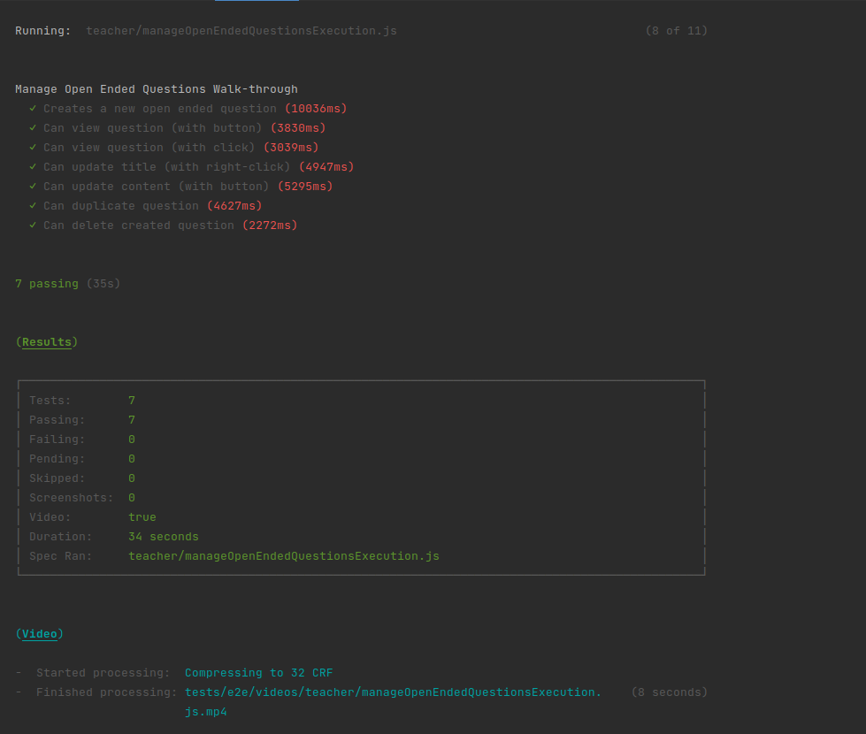
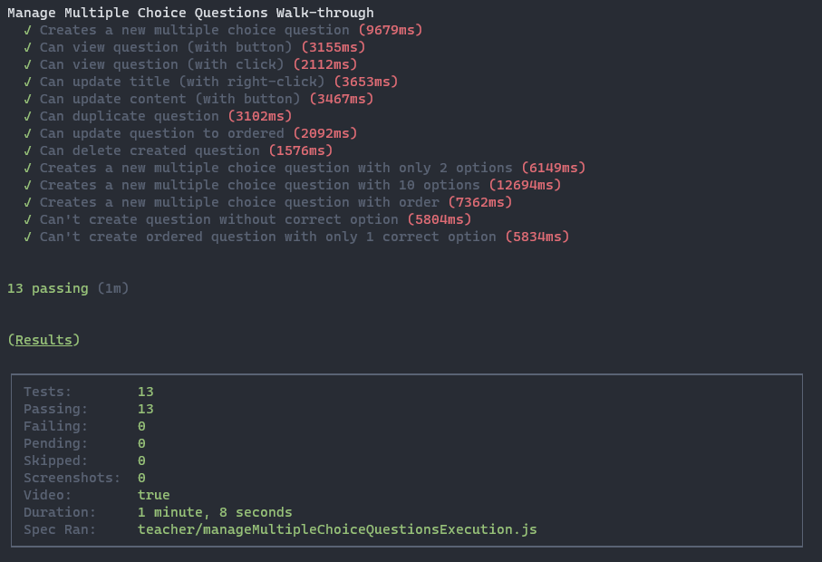
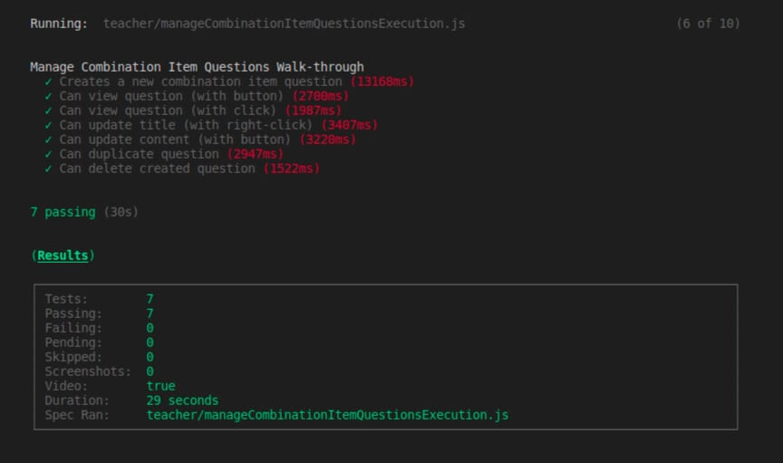

# ES21 P3 submission, Group 09

## Feature PRA

### Subgroup

 - Pedro Marques, 93746, lilpedraotyson
   + Issues assigned: [#124](https://github.com/tecnico-softeng/es21-g09/issues/124), [#125](https://github.com/tecnico-softeng/es21-g09/issues/125), [#126](https://github.com/tecnico-softeng/es21-g09/issues/126)
 - Afonso Bate, 90697, afonsobate
   + Issues assigned: [#127](https://github.com/tecnico-softeng/es21-g09/issues/127), [#128](https://github.com/tecnico-softeng/es21-g09/issues/128), [#129](https://github.com/tecnico-softeng/es21-g09/issues/129), [#130](https://github.com/tecnico-softeng/es21-g09/issues/130)
 
### Pull requests associated with this feature

The list of pull requests associated with this feature is:

 - [PR #136](https://github.com/tecnico-softeng/es21-g09/pull/136)
 - [PR #138](https://github.com/tecnico-softeng/es21-g09/pull/138)

### Frontend

#### New/Updated Views

 - [OpenEndedCreate](https://github.com/tecnico-softeng/es21-g09/blob/ce12dd461511ab30ed8fe69a8d7c55db170d2690/frontend/src/components/open-ended/OpenEndedCreate.vue)
 - [OpenEndedView](https://github.com/tecnico-softeng/es21-g09/blob/ce12dd461511ab30ed8fe69a8d7c55db170d2690/frontend/src/components/open-ended/OpenEndedView.vue)

#### New/Updated Models

 - [CombinationItemQuestionDetails](https://github.com/tecnico-softeng/es21-g09/blob/ce12dd461511ab30ed8fe69a8d7c55db170d2690/frontend/src/models/management/questions/OpenEndedQuestionDetails.ts)

### End-to-end tests

#### Created tests

 - [Creates a new open ended question](https://github.com/tecnico-softeng/es21-g09/blob/ce12dd461511ab30ed8fe69a8d7c55db170d2690/frontend/tests/e2e/specs/teacher/manageOpenEndedQuestionsExecution.js#L64)
 - [Can view question (with button)](https://github.com/tecnico-softeng/es21-g09/blob/ce12dd461511ab30ed8fe69a8d7c55db170d2690/frontend/tests/e2e/specs/teacher/manageOpenEndedQuestionsExecution.js#L111)
 - [Can view question (with click)](https://github.com/tecnico-softeng/es21-g09/blob/ce12dd461511ab30ed8fe69a8d7c55db170d2690/frontend/tests/e2e/specs/teacher/manageOpenEndedQuestionsExecution.js#L131)
 - [Can update title (with right-click)](https://github.com/tecnico-softeng/es21-g09/blob/ce12dd461511ab30ed8fe69a8d7c55db170d2690/frontend/tests/e2e/specs/teacher/manageOpenEndedQuestionsExecution.js#L147)
 - [Can update content (with button)](https://github.com/tecnico-softeng/es21-g09/blob/ce12dd461511ab30ed8fe69a8d7c55db170d2690/frontend/tests/e2e/specs/teacher/manageOpenEndedQuestionsExecution.js#L184)
 - [Can duplicate question](https://github.com/tecnico-softeng/es21-g09/blob/ce12dd461511ab30ed8fe69a8d7c55db170d2690/frontend/tests/e2e/specs/teacher/manageOpenEndedQuestionsExecution.js#L227)
 - [Can delete created question](https://github.com/tecnico-softeng/es21-g09/blob/ce12dd461511ab30ed8fe69a8d7c55db170d2690/frontend/tests/e2e/specs/teacher/manageOpenEndedQuestionsExecution.js#L276)

#### Commands defined

 - [commands.js](https://github.com/tecnico-softeng/es21-g09/blob/ce12dd461511ab30ed8fe69a8d7c55db170d2690/frontend/tests/e2e/support/commands.js)

#### Screenshot of test results overview

---

## Feature PEM

### Subgroup

- Henrique Lin, 94235, HenriqueLin
   + Issues assigned: [#112](https://github.com/tecnico-softeng/es21-g09/issues/112), [#113](https://github.com/tecnico-softeng/es21-g09/issues/113), [#116](https://github.com/tecnico-softeng/es21-g09/issues/116), [#117](https://github.com/tecnico-softeng/es21-g09/issues/117), [#118](https://github.com/tecnico-softeng/es21-g09/issues/118), [#119](https://github.com/tecnico-softeng/es21-g09/issues/119)
- Miguel Gonçalves, 94238, Extreme33-ux
   + Issues assigned: [#114](https://github.com/tecnico-softeng/es21-g09/issues/114), [#115](https://github.com/tecnico-softeng/es21-g09/issues/115)

### Pull requests associated with this feature

The list of pull requests associated with this feature is:

- [PR #131](https://github.com/tecnico-softeng/es21-g09/pull/131)
- [PR #142](https://github.com/tecnico-softeng/es21-g09/pull/142)

### Frontend

#### New/Updated Views

- [MultipleChoiceView](https://github.com/tecnico-softeng/es21-g09/blob/pem/frontend/src/components/multiple-choice/MultipleChoiceView.vue)
- [MultipleChoiceCreate](https://github.com/tecnico-softeng/es21-g09/blob/pem/frontend/src/components/multiple-choice/MultipleChoiceCreate.vue)
- [MultipleChoiceOptionEditor](https://github.com/tecnico-softeng/es21-g09/blob/pem/frontend/src/components/multiple-choice/MultipleChoiceOptionEditor.vue)

#### New/Updated Models

- [MultipleChoiceQuestionDetails](https://github.com/tecnico-softeng/es21-g09/blob/pem/frontend/src/models/management/questions/MultipleChoiceQuestionDetails.ts)
- [Option](https://github.com/tecnico-softeng/es21-g09/blob/pem/frontend/src/models/management/Option.ts)

### End-to-end tests

#### Created tests

- [Can update question to ordered](https://github.com/tecnico-softeng/es21-g09/blob/2ec45c78d2e029206bd3aa24d64a8769f5a3e62d/frontend/tests/e2e/specs/teacher/manageMultipleChoiceQuestionsExecution.js#L238)
- [Creates a new multiple choice question with order](https://github.com/tecnico-softeng/es21-g09/blob/2ec45c78d2e029206bd3aa24d64a8769f5a3e62d/frontend/tests/e2e/specs/teacher/manageMultipleChoiceQuestionsExecution.js#L374)
- [Can\'t create question without correct option](https://github.com/tecnico-softeng/es21-g09/blob/2ec45c78d2e029206bd3aa24d64a8769f5a3e62d/frontend/tests/e2e/specs/teacher/manageMultipleChoiceQuestionsExecution.js#L428)
- [Can\'t create ordered question with only 1 correct option](https://github.com/tecnico-softeng/es21-g09/blob/2ec45c78d2e029206bd3aa24d64a8769f5a3e62d/frontend/tests/e2e/specs/teacher/manageMultipleChoiceQuestionsExecution.js#L450)

#### Commands defined

- [commands.js](https://github.com/tecnico-softeng/es21-g09/blob/pem/frontend/tests/e2e/support/commands.js)

#### Screenshot of test results overview

---

## Feature PCI

### Subgroup

- João Salgueiro, ist193725, JGSalgueiro
   + Issues assigned: [#132](https://github.com/tecnico-softeng/es21-g09/issues/132), [#133](https://github.com/tecnico-softeng/es21-g09/issues/133),[#139](https://github.com/tecnico-softeng/es21-g09/issues/139),[#150](https://github.com/tecnico-softeng/es21-g09/issues/150), [#151](https://github.com/tecnico-softeng/es21-g09/issues/151)
- David Miranda, ist193725, gllam
   + Issues assigned: [#135](https://github.com/tecnico-softeng/es21-g09/issues/135), [#137](https://github.com/tecnico-softeng/es21-g09/issues/137), [#140](https://github.com/tecnico-softeng/es21-g09/issues/140), [#141](https://github.com/tecnico-softeng/es21-g09/issues/141),[#149](https://github.com/tecnico-softeng/es21-g09/issues/149),

### Pull requests associated with this feature

The list of pull requests associated with this feature is:

- [PR #134](https://github.com/tecnico-softeng/es21-g09/pull/134)
- [PR #143](https://github.com/tecnico-softeng/es21-g09/pull/143)
- [PR #152](https://github.com/tecnico-softeng/es21-g09/pull/152)
- [PR #154](https://github.com/tecnico-softeng/es21-g09/pull/154)
- [PR #155](https://github.com/tecnico-softeng/es21-g09/pull/155)

### Refactoring of the Code
 - Backend  [PR #152](https://github.com/tecnico-softeng/es21-g09/pull/152)
 - Frontend [PR #154](https://github.com/tecnico-softeng/es21-g09/pull/154)

### Frontend

#### New/Updated Views

 - [CombinationItemCreate](https://github.com/tecnico-softeng/es21-g09/blob/develop/frontend/src/components/combination-item/CombinationItemCreate.vue)
 - [CombinationItemView](https://github.com/tecnico-softeng/es21-g09/blob/develop/frontend/src/components/combination-item/CombinationItemView.vue)
 - [CombOptionEditor](https://github.com/tecnico-softeng/es21-g09/blob/develop/frontend/src/components/combination-item/CombOptionEditor.vue)

#### New/Updated Models

- [CombinationItemQuestionDetails](https://github.com/tecnico-softeng/es21-g09/blob/develop/frontend/src/models/management/questions/CombinationItemQuestionDetails.ts)
- [CombOption](https://github.com/tecnico-softeng/es21-g09/blob/develop/frontend/src/models/management/questions/CombOption.ts)

### End-to-end tests

#### Created tests

- [Creates a new open ended question](https://github.com/tecnico-softeng/es21-g09/blob/develop/frontend/tests/e2e/specs/teacher/manageCombinationItemQuestionsExecution.js#L54)
 - [Can view question (with button)](https://github.com/tecnico-softeng/es21-g09/blob/develop/frontend/tests/e2e/specs/teacher/manageCombinationItemQuestionsExecution.js#L143)
 - [Can view question (with click)](https://github.com/tecnico-softeng/es21-g09/blob/develop/frontend/tests/e2e/specs/teacher/manageCombinationItemQuestionsExecution.js#L158)
 - [Can update title (with right-click)](https://github.com/tecnico-softeng/es21-g09/blob/develop/frontend/tests/e2e/specs/teacher/manageCombinationItemQuestionsExecution.js#L171)
 - [Can update content (with button)](https://github.com/tecnico-softeng/es21-g09/blob/develop/frontend/tests/e2e/specs/teacher/manageCombinationItemQuestionsExecution.js#L211)
 - [Can duplicate question](https://github.com/tecnico-softeng/es21-g09/blob/develop/frontend/tests/e2e/specs/teacher/manageCombinationItemQuestionsExecution.js#L250)
 - [Can delete created question](https://github.com/tecnico-softeng/es21-g09/blob/develop/frontend/tests/e2e/specs/teacher/manageCombinationItemQuestionsExecution.js#L290)

#### Screenshot of test results overview

