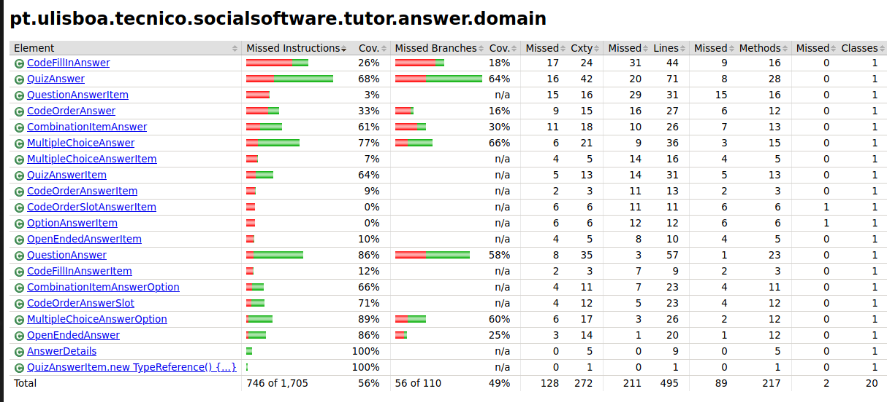
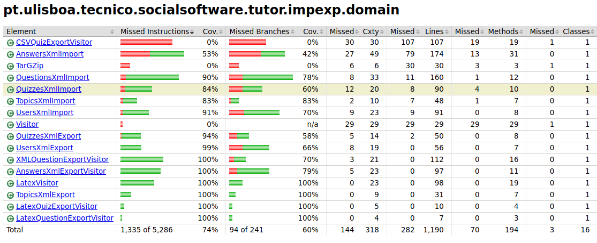
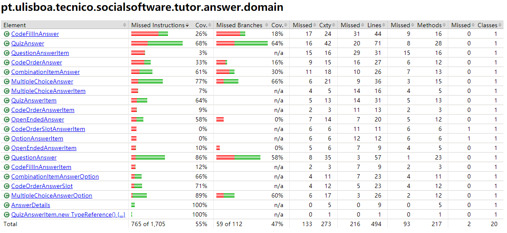
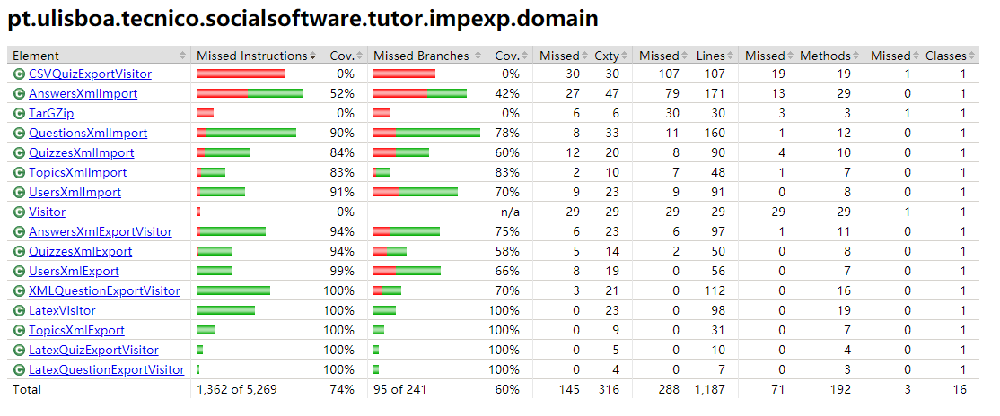
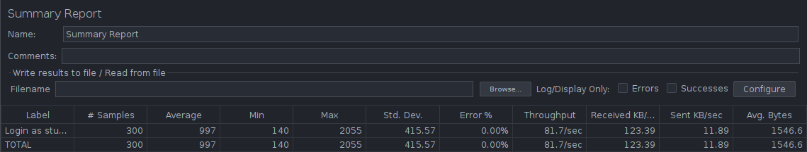
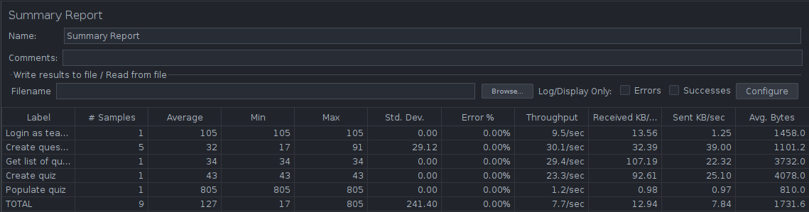
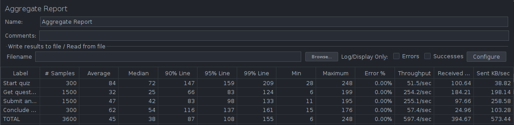
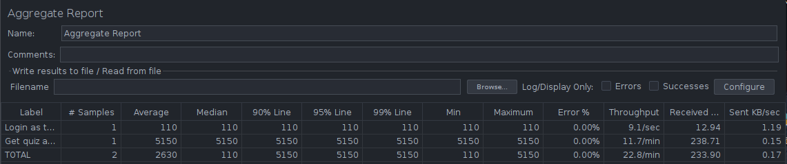
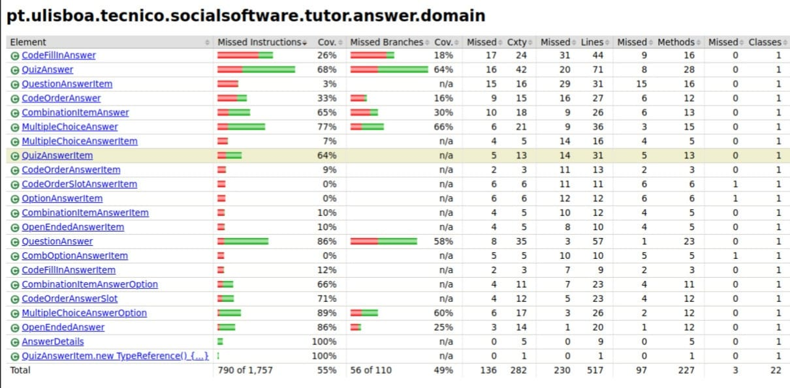
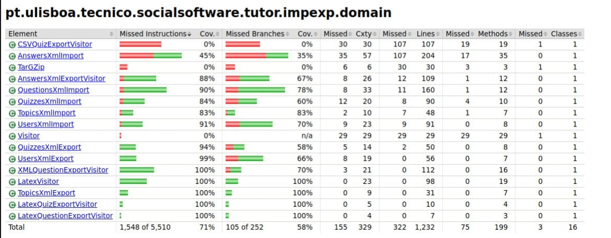

# ES21 P4 submission, Group 09

## Feature PRA

### Subgroup

 - Pedro Marques, 93746, lilpedraotyson 
   + Issues assigned: [#177](https://github.com/tecnico-softeng/es21-g09/issues/177), [#178](https://github.com/tecnico-softeng/es21-g09/issues/178), [#179](https://github.com/tecnico-softeng/es21-g09/issues/179), [#193](https://github.com/tecnico-softeng/es21-g09/issues/193), [#194](https://github.com/tecnico-softeng/es21-g09/issues/194), [#195](https://github.com/tecnico-softeng/es21-g09/issues/195)
   + Tasks: F1:Service, F1:Spock Tests, etc
 - Afonso Bate, 90697, afonsobate 
   + Issues assigned: [#164](https://github.com/tecnico-softeng/es21-g09/issues/164), [#165](https://github.com/tecnico-softeng/es21-g09/issues/165), [#166](https://github.com/tecnico-softeng/es21-g09/issues/166), [#183](https://github.com/tecnico-softeng/es21-g09/issues/183), [#184](https://github.com/tecnico-softeng/es21-g09/issues/184), [#185](https://github.com/tecnico-softeng/es21-g09/issues/185)
   + Tasks: F2:Service, F2:Spock Tests, etc
 
### Pull requests associated with this feature

The list of pull requests associated with this feature is:

 - [PR #176](https://github.com/tecnico-softeng/es21-g09/pull/176)
 - [PR #192](https://github.com/tecnico-softeng/es21-g09/pull/192)
 - [PR #201](https://github.com/tecnico-softeng/es21-g09/pull/201)
 - [PR #208](https://github.com/tecnico-softeng/es21-g09/pull/208)

### Listed features

Below, we list **only** the implemented features. For each feature, we link the relevant files and we mark which are requested parts are completed.

#### Feature number 1: Student answer a quiz

 - **Service**
  + [OpenEndedAnswer](https://github.com/tecnico-softeng/es21-g09/blob/pra/backend/src/main/java/pt/ulisboa/tecnico/socialsoftware/tutor/answer/domain/OpenEndedAnswer.java)
  + [OpenEndedAnswerItem](https://github.com/tecnico-softeng/es21-g09/blob/pra/backend/src/main/java/pt/ulisboa/tecnico/socialsoftware/tutor/answer/domain/OpenEndedAnswerItem.java)
  + [OpenEndedAnswerDto](https://github.com/tecnico-softeng/es21-g09/blob/pra/backend/src/main/java/pt/ulisboa/tecnico/socialsoftware/tutor/answer/dto/OpenEndedAnswerDto.java)
  + [OpenEndedCorrectAnswerDto](https://github.com/tecnico-softeng/es21-g09/blob/pra/backend/src/main/java/pt/ulisboa/tecnico/socialsoftware/tutor/answer/dto/OpenEndedCorrectAnswerDto.java)
  + [OpenEndedStatementAnswerDetailsDto](https://github.com/tecnico-softeng/es21-g09/blob/pra/backend/src/main/java/pt/ulisboa/tecnico/socialsoftware/tutor/answer/dto/OpenEndedStatementAnswerDetailsDto.java)
  + [OpenEndedStatementQuestionDetailsDto](https://github.com/tecnico-softeng/es21-g09/blob/pra/backend/src/main/java/pt/ulisboa/tecnico/socialsoftware/tutor/answer/dto/OpenEndedStatementQuestionDetailsDto.java)
  + [OpenEndedQuestion](https://github.com/tecnico-softeng/es21-g09/blob/pra/backend/src/main/java/pt/ulisboa/tecnico/socialsoftware/tutor/question/domain/OpenEndedQuestion.java)
- **Service tests**
  + [AnswerOpenEndedQuestionTest](https://github.com/tecnico-softeng/es21-g09/blob/pra/backend/src/test/groovy/pt/ulisboa/tecnico/socialsoftware/tutor/answer/service/AnswerOpenEndedQuestionTest.groovy)
- **Webservice tests**
  + [AnswerWebServiceIT](https://github.com/tecnico-softeng/es21-g09/blob/pra/backend/src/test/groovy/pt/ulisboa/tecnico/socialsoftware/tutor/answer/webservice/AnswerWebServiceIT.groovy)
  + [AnswerQuizWebServiceIT](https://github.com/tecnico-softeng/es21-g09/blob/pra/backend/src/test/groovy/pt/ulisboa/tecnico/socialsoftware/tutor/answer/webservice/AnswerQuizWebServiceIT.groovy)
   
##### Test Coverage Screenshot

The screenshot includes the test coverage results associated with the new/changed entities:

#### Feature number 2: Student consult the result of a quiz

- **Service**
  + None
- **Service tests**
  + [ConsultOpenEndedQuestionTest](https://github.com/tecnico-softeng/es21-g09/blob/pra/backend/src/test/groovy/pt/ulisboa/tecnico/socialsoftware/tutor/answer/service/ConsultOpenEndedQuestionTest.groovy)
- **Webservice tests**
  + [ConsultQuizWebServiceIT](https://github.com/tecnico-softeng/es21-g09/blob/pra/backend/src/test/groovy/pt/ulisboa/tecnico/socialsoftware/tutor/answer/webservice/ConsultQuizWebServiceIT.groovy)

##### Test Coverage Screenshot
No new/changed entities

#### Feature number 3: Teacher consult the result of a quiz

- **Service**
  + [OpenEndedQuestion](https://github.com/tecnico-softeng/es21-g09/blob/pra/backend/src/main/java/pt/ulisboa/tecnico/socialsoftware/tutor/question/domain/OpenEndedQuestion.java)
- **Service tests**
  + [GetOpenEndedQuizAnswersTest](https://github.com/tecnico-softeng/es21-g09/blob/pra/backend/src/test/groovy/pt/ulisboa/tecnico/socialsoftware/tutor/quiz/service/GetOpenEndedQuizAnswersTest.groovy)
- **Webservice tests**
  + [GetQuizAnswersWebServiceIT](https://github.com/tecnico-softeng/es21-g09/blob/pra/backend/src/test/groovy/pt/ulisboa/tecnico/socialsoftware/tutor/quiz/webservice/GetQuizAnswersWebServiceIT.groovy)
  + [QuizWebServiceIT](https://github.com/tecnico-softeng/es21-g09/blob/pra/backend/src/test/groovy/pt/ulisboa/tecnico/socialsoftware/tutor/quiz/webservice/QuizWebServiceIT.groovy)

##### Test Coverage Screenshot

The screenshot includes the test coverage results associated with the new/changed entities:

#### Feature number 4: Teacher export a quiz

- **Service**
  + [OpenEndedAnswer](https://github.com/tecnico-softeng/es21-g09/blob/pra/backend/src/main/java/pt/ulisboa/tecnico/socialsoftware/tutor/answer/domain/OpenEndedAnswer.java)
  + [OpenEndedAnswerItem](https://github.com/tecnico-softeng/es21-g09/blob/pra/backend/src/main/java/pt/ulisboa/tecnico/socialsoftware/tutor/answer/domain/OpenEndedAnswerItem.java)
  + [AnswersXmlExportVisitor](https://github.com/tecnico-softeng/es21-g09/blob/pra/backend/src/main/java/pt/ulisboa/tecnico/socialsoftware/tutor/impexp/domain/AnswersXmlExportVisitor.java)
  + [AnswersXmlImport](https://github.com/tecnico-softeng/es21-g09/blob/pra/backend/src/main/java/pt/ulisboa/tecnico/socialsoftware/tutor/impexp/domain/AnswersXmlImport.java)
  + [OpenEndedQuestion](https://github.com/tecnico-softeng/es21-g09/blob/pra/backend/src/main/java/pt/ulisboa/tecnico/socialsoftware/tutor/question/domain/OpenEndedQuestion.java)
- **Service tests**
  + [ImportExportOpenEndedAnswersTest](https://github.com/tecnico-softeng/es21-g09/blob/pra/backend/src/test/groovy/pt/ulisboa/tecnico/socialsoftware/tutor/impexp/service/ImportExportOpenEndedAnswersTest.groovy)
- **Webservice test**
  + [ExportQuizAnswersWebServiceIT](https://github.com/tecnico-softeng/es21-g09/blob/pra/backend/src/test/groovy/pt/ulisboa/tecnico/socialsoftware/tutor/quiz/webservice/ExportQuizAnswersWebServiceIT.groovy)

##### Test Coverage Screenshot

The screenshot includes the test coverage results associated with the new/changed entities:

### Cypress end-to-end test

- **Cypress use case test**
  + [student/multipleChoiceQuiz](https://github.com/tecnico-softeng/es21-g09/blob/pra/frontend/tests/e2e/specs/student/openEndedQuiz.js)
  + [teacher/multipleChoiceQuiz](https://github.com/tecnico-softeng/es21-g09/blob/pra/frontend/tests/e2e/specs/teacher/openEndedQuiz.js)
  + [commands](https://github.com/tecnico-softeng/es21-g09/blob/pra/frontend/tests/e2e/support/commands.js)

### JMeter Load test

Each subgroup member defined one reading test and one writing test. The direct links to these are:

- [LoadJMeter](https://github.com)

#### Screenshots of Reports

---

## Feature PEM

### Subgroup

- Henrique Lin, 94235, HenriqueLin
    + Issues assigned: [#161](https://github.com/tecnico-softeng/es21-g09/issues/161), [#162](https://github.com/tecnico-softeng/es21-g09/issues/162), [#163](https://github.com/tecnico-softeng/es21-g09/issues/163), [#180](https://github.com/tecnico-softeng/es21-g09/issues/180), [#181](https://github.com/tecnico-softeng/es21-g09/issues/181), [#182](https://github.com/tecnico-softeng/es21-g09/issues/182), [#211](https://github.com/tecnico-softeng/es21-g09/issues/211), [#212](https://github.com/tecnico-softeng/es21-g09/issues/212), [#216](https://github.com/tecnico-softeng/es21-g09/issues/216)
    + Tasks: F1:All, F3:All, Cypress, Jmeter
- Miguel Gonçalves, 94238, Extreme33-ux
    + Issues assigned: [#172](https://github.com/tecnico-softeng/es21-g09/issues/172), [#173](https://github.com/tecnico-softeng/es21-g09/issues/173), [#174](https://github.com/tecnico-softeng/es21-g09/issues/174), [#188](https://github.com/tecnico-softeng/es21-g09/issues/188), [#189](https://github.com/tecnico-softeng/es21-g09/issues/189), [#190](https://github.com/tecnico-softeng/es21-g09/issues/190)
    + Tasks: F2:All, F4:All

### Pull requests associated with this feature

The list of pull requests associated with this feature is:

- [PR #170](https://github.com/tecnico-softeng/es21-g09/pull/170)
- [PR #175](https://github.com/tecnico-softeng/es21-g09/pull/175)
- [PR #187](https://github.com/tecnico-softeng/es21-g09/pull/187)
- [PR #200](https://github.com/tecnico-softeng/es21-g09/pull/200)
- [PR #215](https://github.com/tecnico-softeng/es21-g09/pull/215)
- [PR #218](https://github.com/tecnico-softeng/es21-g09/pull/218)

### Listed features

Below, we list **only** the implemented features. For each feature, we link the relevant files and we mark which are requested parts are completed.

#### Feature number 1: Student answer a quiz

- **Service**
  + [MultipleChoiceAnswer](https://github.com/tecnico-softeng/es21-g09/blob/pem/backend/src/main/java/pt/ulisboa/tecnico/socialsoftware/tutor/answer/domain/MultipleChoiceAnswer.java)
  + [MultipleChoiceAnswerItem](https://github.com/tecnico-softeng/es21-g09/blob/pem/backend/src/main/java/pt/ulisboa/tecnico/socialsoftware/tutor/answer/domain/MultipleChoiceAnswerItem.java)
  + [MultipleChoiceAnswerOption](https://github.com/tecnico-softeng/es21-g09/blob/pem/backend/src/main/java/pt/ulisboa/tecnico/socialsoftware/tutor/answer/domain/MultipleChoiceAnswerOption.java)
  + [OptionAnswerItem](https://github.com/tecnico-softeng/es21-g09/blob/pem/backend/src/main/java/pt/ulisboa/tecnico/socialsoftware/tutor/answer/domain/OptionAnswerItem.java)
  + [MultipleChoiceAnswerDto](https://github.com/tecnico-softeng/es21-g09/blob/pem/backend/src/main/java/pt/ulisboa/tecnico/socialsoftware/tutor/answer/dto/MultipleChoiceAnswerDto.java)
  + [MultipleChoiceAnswerOptionDto](https://github.com/tecnico-softeng/es21-g09/blob/pem/backend/src/main/java/pt/ulisboa/tecnico/socialsoftware/tutor/answer/dto/MultipleChoiceAnswerOptionDto.java)
  + [MultipleChoiceCorrectAnswerDto](https://github.com/tecnico-softeng/es21-g09/blob/pem/backend/src/main/java/pt/ulisboa/tecnico/socialsoftware/tutor/answer/dto/MultipleChoiceCorrectAnswerDto.java)
  + [MultipleChoiceStatementAnswerDetailsDto](https://github.com/tecnico-softeng/es21-g09/blob/pem/backend/src/main/java/pt/ulisboa/tecnico/socialsoftware/tutor/answer/dto/MultipleChoiceStatementAnswerDetailsDto.java)
  + [MultipleChoiceStatementQuestionDetailsDto](https://github.com/tecnico-softeng/es21-g09/blob/pem/backend/src/main/java/pt/ulisboa/tecnico/socialsoftware/tutor/answer/dto/MultipleChoiceStatementQuestionDetailsDto.java)
  + [OptionStatementAnswerDetailsDto](https://github.com/tecnico-softeng/es21-g09/blob/pem/backend/src/main/java/pt/ulisboa/tecnico/socialsoftware/tutor/answer/dto/OptionStatementAnswerDetailsDto.java)
  + [MultipleChoiceQuestion](https://github.com/tecnico-softeng/es21-g09/blob/pem/backend/src/main/java/pt/ulisboa/tecnico/socialsoftware/tutor/question/domain/MultipleChoiceQuestion.java)
  + [Option](https://github.com/tecnico-softeng/es21-g09/blob/pem/backend/src/main/java/pt/ulisboa/tecnico/socialsoftware/tutor/question/domain/Option.java)
- **Service tests**
  + [AnswerMultipleChoiceQuestionTest](https://github.com/tecnico-softeng/es21-g09/blob/pem/backend/src/test/groovy/pt/ulisboa/tecnico/socialsoftware/tutor/answer/service/AnswerMultipleChoiceQuestionTest.groovy)
- **Webservice tests**
  + [AnswerWebServiceIT](https://github.com/tecnico-softeng/es21-g09/blob/pem/backend/src/test/groovy/pt/ulisboa/tecnico/socialsoftware/tutor/answer/webservice/AnswerWebServiceIT.groovy)
  + [AnswerQuizWebServiceIT](https://github.com/tecnico-softeng/es21-g09/blob/pem/backend/src/test/groovy/pt/ulisboa/tecnico/socialsoftware/tutor/answer/webservice/AnswerQuizWebServiceIT.groovy)

##### Test Coverage Screenshot

The screenshot includes the test coverage results associated with the new/changed entities:

#### Feature number 2: Student consult the result of a quiz

- **Service**
  + None
- **Service tests**
  + [ConsultMultipleChoiceQuestionTest](https://github.com/tecnico-softeng/es21-g09/blob/pem/backend/src/test/groovy/pt/ulisboa/tecnico/socialsoftware/tutor/answer/service/ConsultMultipleChoiceQuestionTest.groovy)
- **Webservice tests**
  + [ConsultQuizWebServiceIT](https://github.com/tecnico-softeng/es21-g09/blob/pem/backend/src/test/groovy/pt/ulisboa/tecnico/socialsoftware/tutor/answer/webservice/ConsultQuizWebServiceIT.groovy)

##### Test Coverage Screenshot
No new/changed entities

#### Feature number 3: Teacher consult the result of a quiz

- **Service**
  + [MultipleChoiceQuestion](https://github.com/tecnico-softeng/es21-g09/blob/pem/backend/src/main/java/pt/ulisboa/tecnico/socialsoftware/tutor/question/domain/MultipleChoiceQuestion.java)
- **Service tests**
  + [GetMultipleChoiceQuizAnswersTest](https://github.com/tecnico-softeng/es21-g09/blob/pem/backend/src/test/groovy/pt/ulisboa/tecnico/socialsoftware/tutor/quiz/service/GetMultipleChoiceQuizAnswersTest.groovy)
- **Webservice tests**
  + [GetQuizAnswersWebServiceIT](https://github.com/tecnico-softeng/es21-g09/blob/pem/backend/src/test/groovy/pt/ulisboa/tecnico/socialsoftware/tutor/quiz/webservice/GetQuizAnswersWebServiceIT.groovy)
  + [QuizWebServiceIT](https://github.com/tecnico-softeng/es21-g09/blob/pem/backend/src/test/groovy/pt/ulisboa/tecnico/socialsoftware/tutor/quiz/webservice/QuizWebServiceIT.groovy)

##### Test Coverage Screenshot

The screenshot includes the test coverage results associated with the new/changed entities:

#### Feature number 4: Teacher export a quiz

- **Service**
  + [MultipleChoiceAnswer](https://github.com/tecnico-softeng/es21-g09/blob/pem/backend/src/main/java/pt/ulisboa/tecnico/socialsoftware/tutor/answer/domain/MultipleChoiceAnswer.java)
  + [MultipleChoiceAnswerItem](https://github.com/tecnico-softeng/es21-g09/blob/pem/backend/src/main/java/pt/ulisboa/tecnico/socialsoftware/tutor/answer/domain/MultipleChoiceAnswerItem.java)
  + [AnswersXmlExportVisitor](https://github.com/tecnico-softeng/es21-g09/blob/pem/backend/src/main/java/pt/ulisboa/tecnico/socialsoftware/tutor/impexp/domain/AnswersXmlExportVisitor.java)
  + [AnswersXmlImport](https://github.com/tecnico-softeng/es21-g09/blob/pem/backend/src/main/java/pt/ulisboa/tecnico/socialsoftware/tutor/impexp/domain/AnswersXmlImport.java)
  + [MultipleChoiceQuestion](https://github.com/tecnico-softeng/es21-g09/blob/pem/backend/src/main/java/pt/ulisboa/tecnico/socialsoftware/tutor/question/domain/MultipleChoiceQuestion.java)
  + [Option](https://github.com/tecnico-softeng/es21-g09/blob/pem/backend/src/main/java/pt/ulisboa/tecnico/socialsoftware/tutor/question/domain/Option.java)
- **Service tests**
  + [ImportExportMultipleChoiceAnswersTest](https://github.com/tecnico-softeng/es21-g09/blob/pem/backend/src/test/groovy/pt/ulisboa/tecnico/socialsoftware/tutor/impexp/service/ImportExportMultipleChoiceAnswersTest.groovy)
- **Webservice test**
  + [ExportQuizAnswersWebServiceIT](https://github.com/tecnico-softeng/es21-g09/blob/pem/backend/src/test/groovy/pt/ulisboa/tecnico/socialsoftware/tutor/quiz/webservice/ExportQuizAnswersWebServiceIT.groovy)

##### Test Coverage Screenshot

The screenshot includes the test coverage results associated with the new/changed entities:

### Cypress end-to-end test

- **Cypress use case test**
  + [student/multipleChoiceQuiz](https://github.com/tecnico-softeng/es21-g09/blob/pem/frontend/tests/e2e/specs/student/multipleChoiceQuiz.js)
  + [teacher/multipleChoiceQuiz](https://github.com/tecnico-softeng/es21-g09/blob/pem/frontend/tests/e2e/specs/teacher/multipleChoiceQuiz.js)
  + [commands](https://github.com/tecnico-softeng/es21-g09/blob/pem/frontend/tests/e2e/support/commands.js)

### JMeter Load test

Each subgroup member defined one reading test and one writing test. The direct links to these are:

- [LoadJMeter](https://github.com/tecnico-softeng/es21-g09/blob/pem/backend/jmeter/answer/quiz-answer-muliple-choice.jmx)

#### Screenshots of Reports

---

## Feature PCI

### Subgroup

- João Salgueiro, ist193725, JGSalgueiro
   + Issues assigned: [#167](https://github.com/tecnico-softeng/es21-g09/issues/167), [#168](https://github.com/tecnico-softeng/es21-g09/issues/168),[#196](https://github.com/tecnico-softeng/es21-g09/issues/196), [#204](https://github.com/tecnico-softeng/es21-g09/issues/204), [#205](https://github.com/tecnico-softeng/es21-g09/issues/205),[#214](https://github.com/tecnico-softeng/es21-g09/issues/214),[#221](https://github.com/tecnico-softeng/es21-g09/issues/221)
   + Tasks: F1:ALL, F2:ALL, F3:ALL, F4:ALL, F5: service
- David Miranda, ist193725, gllam
   + Issues assigned: [#167](https://github.com/tecnico-softeng/es21-g09/issues/135), [#191](https://github.com/tecnico-softeng/es21-g09/issues/191), [#197](https://github.com/tecnico-softeng/es21-g09/issues/197), [#203](https://github.com/tecnico-softeng/es21-g09/issues/203),[#206](https://github.com/tecnico-softeng/es21-g09/issues/206),[#214](https://github.com/tecnico-softeng/es21-g09/issues/214),[#221](https://github.com/tecnico-softeng/es21-g09/issues/221)
   + Tasks: F1:ALL, F2:ALL, F3:ALL, F4:ALL, F5: service

### Pull requests associated with this feature

The list of pull requests associated with this feature is:

- [PR #171](https://github.com/tecnico-softeng/es21-g09/pull/171)
- [PR #186](https://github.com/tecnico-softeng/es21-g09/pull/186)
- [PR #199](https://github.com/tecnico-softeng/es21-g09/pull/199)
- [PR #210](https://github.com/tecnico-softeng/es21-g09/pull/21O)
- [PR #220](https://github.com/tecnico-softeng/es21-g09/pull/220)

### Listed features

Below, we list **only** the implemented features. For each feature, we link the relevant files and we mark which are requested parts are completed.

#### Feature number 1: Student answer a quiz

- **Service**
  + [CombinationItemAnswer](https://github.com/tecnico-softeng/es21-g09/blob/pci/backend/src/main/java/pt/ulisboa/tecnico/socialsoftware/tutor/answer/domain/CombinationItemAnswer.java)
  + [CombinationItemAnswerItem](https://github.com/tecnico-softeng/es21-g09/blob/pci/backend/src/main/java/pt/ulisboa/tecnico/socialsoftware/tutor/answer/domain/CombinationItemAnswerItem.java)
  + [CombinationItemAnswerOption](https://github.com/tecnico-softeng/es21-g09/blob/pci/backend/src/main/java/pt/ulisboa/tecnico/socialsoftware/tutor/answer/domain/CombinationItemAnswerOption.java)
  + [CombOptionAnswerItem](https://github.com/tecnico-softeng/es21-g09/blob/pci/backend/src/main/java/pt/ulisboa/tecnico/socialsoftware/tutor/answer/domain/CombOptionAnswerItem.java)
  + [CombinationItemAnswerDto](https://github.com/tecnico-softeng/es21-g09/blob/pci/backend/src/main/java/pt/ulisboa/tecnico/socialsoftware/tutor/answer/dto/CombinationItemAnswerDto.java)
  + [CombinationItemAnswerOptionDto](https://github.com/tecnico-softeng/es21-g09/blob/pci/backend/src/main/java/pt/ulisboa/tecnico/socialsoftware/tutor/answer/dto/CombinationItemAnswerOptionDto.java)
  + [CombinationItemCorrectAnswerDto](https://github.com/tecnico-softeng/es21-g09/blob/pci/backend/src/main/java/pt/ulisboa/tecnico/socialsoftware/tutor/answer/dto/CombinationItemCorrectAnswerDto.java)
  + [CombinationItemStatementAnswerDetailsDto](https://github.com/tecnico-softeng/es21-g09/blob/pci/backend/src/main/java/pt/ulisboa/tecnico/socialsoftware/tutor/answer/dto/CombinationItemStatementAnswerDetailsDto.java)
  + [CombinationItemStatementQuestionDetailsDto](https://github.com/tecnico-softeng/es21-g09/blob/pci/backend/src/main/java/pt/ulisboa/tecnico/socialsoftware/tutor/answer/dto/CombinationItemStatementQuestionDetailsDto.java)
  + [CombOptionStatementAnswerDetailsDto](https://github.com/tecnico-softeng/es21-g09/blob/pem/backend/src/main/java/pt/ulisboa/tecnico/socialsoftware/tutor/answer/dto/CombOptionStatementAnswerDetailsDto.java)
  + [CombinationItemQuestion](https://github.com/tecnico-softeng/es21-g09/blob/pci/backend/src/main/java/pt/ulisboa/tecnico/socialsoftware/tutor/question/domain/CombinationItemQuestion.java)
  + [CombOption](https://github.com/tecnico-softeng/es21-g09/blob/pci/backend/src/main/java/pt/ulisboa/tecnico/socialsoftware/tutor/question/domain/CombOption.java)
- **Service tests**
  + [AnswerCombinationItemQuestionTest](https://github.com/tecnico-softeng/es21-g09/blob/pci/backend/src/test/groovy/pt/ulisboa/tecnico/socialsoftware/tutor/answer/service/AnswerCombinationItemQuestionTest.groovy)
- **Webservice tests**
  + [AnswerWebServiceIT](https://github.com/tecnico-softeng/es21-g09/blob/pci/backend/src/test/groovy/pt/ulisboa/tecnico/socialsoftware/tutor/answer/webservice/AnswerWebServiceIT.groovy)
  + [AnswerQuizWebServiceIT](https://github.com/tecnico-softeng/es21-g09/blob/pci/backend/src/test/groovy/pt/ulisboa/tecnico/socialsoftware/tutor/answer/webservice/AnswerQuizWebServiceIT.groovy)

##### Test Coverage Screenshot

The screenshot includes the test coverage results associated with the new/changed entities:

#### Feature number 2: Student consult the result of a quiz

- **Service**
  + None
- **Service tests**
  + [ConsultCombinationItemQuestionTest](https://github.com/tecnico-softeng/es21-g09/blob/pci/backend/src/test/groovy/pt/ulisboa/tecnico/socialsoftware/tutor/answer/service/ConsultCombinationItemQuestionTest.groovy)
- **Webservice tests**
  + [ConsultQuizWebServiceIT](https://github.com/tecnico-softeng/es21-g09/blob/pci/backend/src/test/groovy/pt/ulisboa/tecnico/socialsoftware/tutor/answer/webservice/ConsultQuizWebServiceIT.groovy)

##### Test Coverage Screenshot

The screenshot includes the test coverage results associated with the new/changed entities:

### Problem Report
- While doing Integration tests a bug on Quiz Tutor was found (From the original project) : The server's response always returns Options with null ID. This does not impact the functioning of the code but its not a correct implementation. Our group sugests a quality of life refactor of the code.
- At the start of the project it was sugested by the teachers that we use two arrays of a new class ("CombOption") for the two sets of items. This solution is not implementable because of a JPA caracteristic. Therefor our group decided to do a refactor of the code and implement only one Array;
- While doing the Integration tests of the quiz webservice an internal error of the server was found. We could not find the problem and even after three consulting sessions with the Teachers nobody knew. Our group found the bug after days of debugging but there was no time left for the implementation of the Cypress tests and Jmeter; 

### Cypress end-to-end test

- End-to-End test with Cypress were not implemented due to a bug with JPA (error 500) that even with consulting with the project managers was only resolved very near of the deadline. 

### JMeter Load test

- JMeter Load test was not implemented due to a bug with JPA (error 500) that even with consulting with the project managers was only resolved very near of the deadline. 
